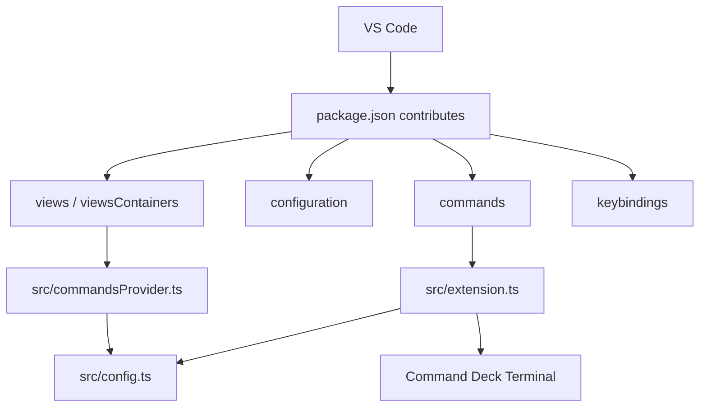
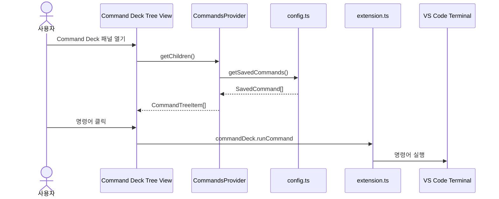
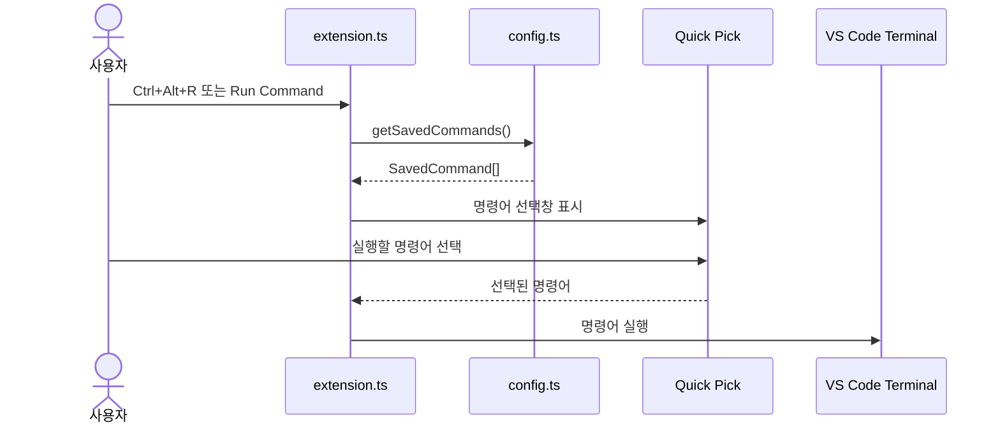
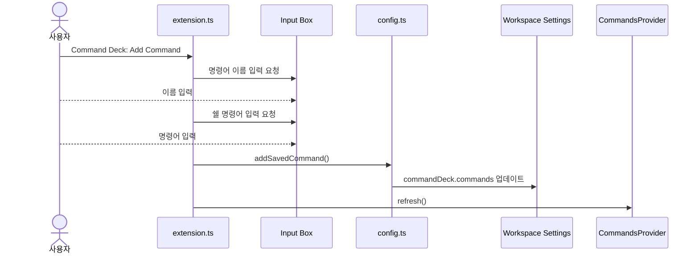

# Command Deck 프로젝트 문서

## 1. 프로젝트 한 줄 요약

Command Deck은 VS Code에서 자주 사용하는 쉘 명령어를 워크스페이스별로 저장하고, Activity Bar 패널, 커맨드 팔레트, 단축키를 통해 빠르게 실행할 수 있게 해주는 TypeScript 기반 VS Code Extension이다.

## 2. 해결하려는 문제

개발자는 프로젝트마다 반복적으로 실행하는 명령어가 있다.

- 빌드: `npm run build`
- 테스트: `npm test`
- 개발 서버 실행: `npm run dev`
- 프로젝트별 커스텀 스크립트

이 명령어들은 자주 쓰이지만 매번 직접 입력해야 하고, 프로젝트마다 명령어가 조금씩 달라 기억하기 번거롭다. Command Deck은 이런 명령어를 VS Code 안에 저장해두고 버튼처럼 실행할 수 있게 만드는 도구다.

## 3. 현재 구현 범위

현재 버전은 MVP다. 복잡한 관리 화면보다는 VS Code Extension의 핵심 흐름을 안정적으로 구현하는 데 집중했다.

구현된 기능:

- Activity Bar에 `Command Deck` 전용 패널 추가
- 워크스페이스 설정 `commandDeck.commands`에 명령어 저장
- 저장된 명령어를 Tree View 목록으로 표시
- Tree View 항목 클릭으로 명령어 실행
- 커맨드 팔레트에서 명령어 실행
- `Ctrl+Alt+R` 단축키로 명령어 선택창 실행
- Quick Pick/Input Box 기반 명령어 추가
- `Command Deck` 전용 터미널 재사용
- Shell Integration 지원 시 `executeCommand`, 미지원 시 `sendText` 사용

현재 제외한 기능:

- 명령어 수정/삭제
- 명령어 그룹화
- 명령어별 아이콘 설정
- 명령어별 작업 디렉터리 설정
- 전역 설정과 워크스페이스 설정 병합
- 실행 성공/실패 상태 추적
- Marketplace 배포 설정

## 4. 기술 스택

| 영역 | 사용 기술 |
| --- | --- |
| 언어 | TypeScript |
| 플랫폼 | Visual Studio Code Extension API |
| 런타임 | Node.js |
| 빌드 | TypeScript Compiler |
| UI | Activity Bar, Tree View, Quick Pick, Input Box, Command Palette |
| 저장소 | VS Code Workspace Configuration |

## 5. 폴더 구조

```text
.
├── .vscode/
│   ├── launch.json
│   └── tasks.json
├── docs/
│   └── Command Deck 포트폴리오 정리.md
├── media/
│   └── icon.svg
├── src/
│   ├── commandsProvider.ts
│   ├── config.ts
│   └── extension.ts
├── .gitignore
├── CONTEXT.md
├── package-lock.json
├── package.json
├── PROJECT_DOCUMENTATION.md
├── README.md
└── tsconfig.json
```

## 6. 주요 파일 설명

### `package.json`

VS Code가 Extension을 인식하는 핵심 선언 파일이다.

담당 역할:

- Extension 이름과 표시명 정의
- VS Code 엔진 버전 정의
- 활성화 조건 정의
- 커맨드 팔레트 명령 등록
- 설정 스키마 등록
- 단축키 등록
- Activity Bar 컨테이너 등록
- Tree View 등록
- 빌드 스크립트 정의
- 개발 의존성 정의

중요 설정:

- 패키지명: `command-deck`
- 표시명: `Command Deck`
- 메인 진입점: `./out/extension.js`
- 설정 키: `commandDeck.commands`
- 기본 단축키: `Ctrl+Alt+R`

### `src/extension.ts`

Extension의 런타임 진입점이다.

담당 역할:

- `activate()`에서 Tree View와 커맨드 등록
- `deactivate()`에서 터미널 참조 정리
- Quick Pick으로 명령어 선택
- Input Box로 명령어 추가
- 저장된 명령어를 터미널에서 실행
- `Command Deck` 전용 터미널 재사용
- 설정 변경 시 Tree View 새로고침

핵심 함수:

- `activate(context)`: Extension 초기화
- `runSelectedCommand()`: 저장된 명령어를 선택해서 실행
- `addCommand()`: 새 명령어 입력 후 저장
- `runSavedCommand(savedCommand)`: 특정 명령어 실행
- `getCommandDeckTerminal()`: 전용 터미널 조회 또는 생성

### `src/config.ts`

설정 저장소와 데이터 검증을 담당한다.

담당 역할:

- `commandDeck.commands` 설정 읽기
- 명령어 객체 검증
- 새 명령어를 워크스페이스 설정에 저장
- 설정 변경 이벤트가 Command Deck 관련 변경인지 확인

핵심 타입:

```ts
export interface SavedCommand {
  name: string;
  command: string;
}
```

핵심 함수:

- `getSavedCommands()`: 설정에서 유효한 명령어 목록 반환
- `addSavedCommand(command)`: 워크스페이스 설정에 명령어 추가
- `isCommandSettingChange(event)`: 설정 변경 이벤트 필터링

### `src/commandsProvider.ts`

Activity Bar에 표시되는 Tree View 데이터를 만든다.

담당 역할:

- 저장된 명령어 목록을 Tree Item으로 변환
- 명령어가 없을 때 빈 상태 항목 표시
- Tree View 새로고침 이벤트 발생
- Tree Item 클릭 시 `commandDeck.runCommand` 실행 연결

핵심 클래스:

- `CommandsProvider`: VS Code `TreeDataProvider` 구현체
- `CommandTreeItem`: 명령어 하나를 표시하는 Tree Item

### `.vscode/launch.json`

VS Code에서 `F5`를 눌렀을 때 Extension Development Host를 실행하는 설정이다.

### `.vscode/tasks.json`

Extension 실행 전 TypeScript 컴파일을 수행하는 빌드 태스크다.

### `README.md`

사용자용 간단 사용 설명서다. 영어 설명과 한국어 안내를 포함한다.

### `CONTEXT.md`

다른 PC에서 작업을 이어받기 위한 빠른 컨텍스트 문서다. 현재 구현 상태, 실행법, 주요 파일, 향후 개선 후보를 짧게 정리한다.

### `docs/Command Deck 포트폴리오 정리.md`

Obsidian에서 포트폴리오 자료로 활용하기 위한 설명 문서다. 프로젝트 배경, 구조, Mermaid 다이어그램, 배운 점, 향후 개선 아이디어를 포함한다.

## 7. VS Code Extension 동작 구조

VS Code Extension은 크게 두 부분으로 구성된다.

1. `package.json`의 선언
2. `src/extension.ts`의 런타임 코드

`package.json`은 VS Code에게 “어떤 명령, 설정, UI, 단축키를 제공하는지” 알려준다. `src/extension.ts`는 실제로 사용자가 명령을 실행했을 때 무엇을 할지 구현한다.



## 8. 사용자 실행 흐름

### Activity Bar에서 실행



### 단축키 또는 커맨드 팔레트에서 실행



### 명령어 추가 흐름



## 9. 데이터 모델

명령어 데이터는 단순한 배열이다.

```json
{
  "commandDeck.commands": [
    {
      "name": "Build",
      "command": "npm run build"
    },
    {
      "name": "Test",
      "command": "npm test"
    }
  ]
}
```

TypeScript 타입은 다음과 같다.

```ts
export interface SavedCommand {
  name: string;
  command: string;
}
```

설계 이유:

- 프로젝트별 명령어는 워크스페이스 설정에 저장하는 것이 자연스럽다.
- v1에서는 복잡한 옵션보다 빠른 실행 경험이 중요하다.
- `name`과 `command`만 있으면 Activity Bar, Quick Pick, 터미널 실행을 모두 구성할 수 있다.

## 10. 터미널 실행 방식

명령어 실행은 `Command Deck` 이름의 전용 터미널을 사용한다.

동작 규칙:

- 이미 열린 `Command Deck` 터미널이 있으면 재사용한다.
- 없으면 새 터미널을 만든다.
- 실행 전 터미널을 화면에 표시한다.
- Shell Integration이 있으면 `executeCommand()`를 사용한다.
- Shell Integration이 없으면 `sendText(command, true)`를 사용한다.
- 사용자가 터미널을 닫으면 내부 참조를 비운다.

이 방식은 명령어를 실행할 때마다 새 터미널이 늘어나는 문제를 줄인다.

## 11. 설정 저장 방식

명령어는 전역 설정이 아니라 워크스페이스 설정에 저장된다.

저장 위치 예:

```text
.vscode/settings.json
```

저장 API:

```ts
vscode.workspace
  .getConfiguration('commandDeck')
  .update('commands', updatedCommands, vscode.ConfigurationTarget.Workspace);
```

워크스페이스가 열려 있지 않으면 저장 위치가 없으므로 명령어 추가를 막고 에러 메시지를 표시한다.

## 12. 개발 환경 준비

필수 도구:

- VS Code
- Node.js
- npm

의존성 설치:

```powershell
npm.cmd install
```

PowerShell에서 `npm`이 실행 정책으로 막힐 수 있으므로 Windows에서는 `npm.cmd` 사용을 권장한다.

## 13. 빌드와 실행

TypeScript 컴파일:

```powershell
npm.cmd run compile
```

개발 모드 실행:

1. VS Code에서 프로젝트 루트를 연다.
2. `F5`를 누른다.
3. 새 `Extension Development Host` 창이 열린다.
4. 새 창에서 Activity Bar의 `Command Deck` 패널을 연다.
5. `+` 버튼으로 명령어를 추가한다.
6. 목록 클릭, 커맨드 팔레트, `Ctrl+Alt+R`로 실행을 테스트한다.

## 14. 테스트 체크리스트

기본 동작:

- `npm.cmd run compile`이 성공한다.
- Extension Development Host가 열린다.
- Activity Bar에 `Command Deck` 아이콘이 보인다.
- 패널에 `Commands` 뷰가 보인다.
- 명령어가 없을 때 빈 상태 문구가 표시된다.

명령어 추가:

- `+` 버튼으로 이름과 명령어를 입력할 수 있다.
- 입력값이 비어 있으면 검증 메시지가 나온다.
- 저장 후 목록이 새로고침된다.
- `.vscode/settings.json`에 `commandDeck.commands`가 저장된다.

명령어 실행:

- Tree View 항목 클릭으로 실행된다.
- `Ctrl+Alt+R`로 Quick Pick이 열린다.
- 커맨드 팔레트에서 `Command Deck: Run Command`가 실행된다.
- 실행 결과가 `Command Deck` 터미널에 표시된다.
- 반복 실행해도 터미널이 계속 새로 생기지 않는다.

## 15. Git 관리 참고

커밋에 포함할 파일:

- `package.json`
- `package-lock.json`
- `tsconfig.json`
- `.gitignore`
- `.vscode/launch.json`
- `.vscode/tasks.json`
- `src/**`
- `media/icon.svg`
- `README.md`
- `CONTEXT.md`
- `PROJECT_DOCUMENTATION.md`
- `docs/**`

커밋에서 제외할 파일:

- `node_modules/`
- `out/`
- `.vscode-test/`
- `*.vsix`

위 제외 대상은 `.gitignore`에 정의되어 있다.

## 16. 향후 개발 로드맵

우선순위가 높은 개선:

- 명령어 수정 기능
- 명령어 삭제 기능
- 명령어 중복 이름 처리
- 명령어 실행 전 확인 옵션
- 실행 실패 표시

기능 확장:

- 명령어 그룹
- 명령어별 아이콘
- 명령어별 작업 디렉터리
- 전역 명령어와 워크스페이스 명령어 동시 지원
- 최근 실행 명령어

배포 준비:

- Extension 아이콘 개선
- README 스크린샷 추가
- `.vsix` 패키징
- Marketplace용 publisher 설정
- CHANGELOG 작성
- LICENSE 추가

## 17. 작업을 이어받을 때 먼저 볼 것

다른 PC에서 작업을 이어받는다면 다음 순서로 확인한다.

1. `CONTEXT.md`: 현재 상태 빠른 파악
2. `PROJECT_DOCUMENTATION.md`: 전체 구조와 설계 파악
3. `README.md`: 사용자 관점 사용법 확인
4. `src/extension.ts`: 런타임 흐름 확인
5. `package.json`: VS Code contribution 확인

## 18. 현재 상태 메모

- 초기 MVP 구현은 완료되어 있다.
- 이전 검증에서 `npm.cmd run compile`은 성공했다.
- `node_modules/`와 `out/`은 생성될 수 있지만 Git에 포함하지 않는다.
- `package-lock.json`은 재현 가능한 의존성 설치를 위해 유지한다.
- 한국어 포트폴리오 문서는 `docs/Command Deck 포트폴리오 정리.md`에 있다.
